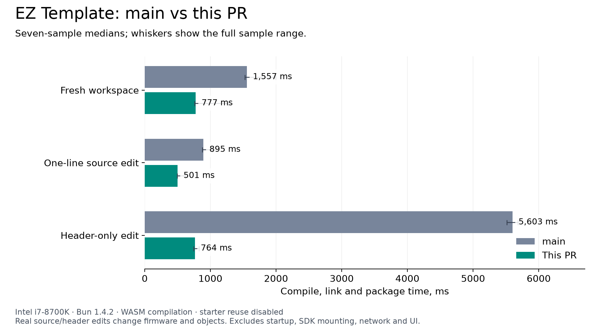
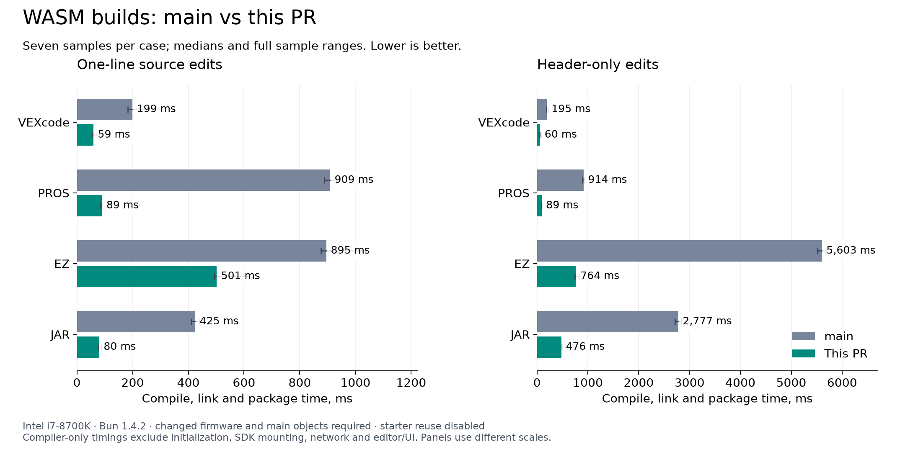

# Comparison against main

The baseline is `origin/main` at `efdb141c67128326882091bcd2632fd5a05d3119`. Both sides were rerun sequentially on October 10, 2026, on an Intel Core i7-8700K with 32 GB RAM, Linux x64 and Bun 1.4.2. Seven samples per template and scenario. The baseline loads its own compiler adapter, package patch and SDK manifest from that exact revision. The optimized side uses this PR's implementation and prepared assets. Both use the same template sources and edit fixtures.

Each sample starts with a new filesystem and empty object cache. Starter-object reuse is disabled. The source edit changes one delay instruction; the header-only edit changes a consumed macro without changing the source. Every edited build must change both firmware and the compiled main object. Unchanged controls are excluded. Fresh workspace measurements can use validated cold SDK assets. They are not cold compiler startup measurements.

These are compiler-only WASM compile/link/package timings, excluding initialization, SDK mounting, network and editor/UI. Browser performance is measured separately on the real application routes in the [one-line edit report](../one-line-edits/report.md). Its final EZ worker medians were 713 ms for source edits and 919 ms for header edits, so sub-500-ms browser builds are not established. Sequential sampling and JIT variation limit small-difference claims.

| Template | Workload | main ms | PR ms | Speedup |
| --- | --- | ---: | ---: | ---: |
| VEXcode | Fresh workspace | 192 | 63 | 3.03× |
| VEXcode | One-line source edit | 199 | 59 | 3.39× |
| VEXcode | Header-only edit | 195 | 60 | 3.24× |
| PROS | Fresh workspace | 931 | 99 | 9.44× |
| PROS | One-line source edit | 909 | 89 | 10.16× |
| PROS | Header-only edit | 914 | 89 | 10.26× |
| EZ | Fresh workspace | 1557 | 777 | 2.01× |
| EZ | One-line source edit | 895 | 501 | 1.79× |
| EZ | Header-only edit | 5603 | 764 | 7.34× |
| JAR | Fresh workspace | 2768 | 487 | 5.68× |
| JAR | One-line source edit | 425 | 80 | 5.33× |
| JAR | Header-only edit | 2777 | 476 | 5.83× |





Raw records, phase spans and object hashes are preserved in [main samples](pr-main.json), [optimized samples](pr-optimized.json) and [summary with ranges](summary.json). Whiskers show minimum and maximum, not confidence intervals. SVG versions are available beside the PNG attachments.

Reproduce from the repository root:

```sh
BUILD_BASELINE_REV=efdb141c67128326882091bcd2632fd5a05d3119 BUILD_BENCH_SAMPLES=7 bun apps/code/scripts/benchmark-compiler-edits.ts pr-main
BUILD_BENCH_SAMPLES=7 bun apps/code/scripts/benchmark-compiler-edits.ts pr-optimized
python3 apps/code/scripts/report-compiler-main.py
```

Chart export requires Python with matplotlib. Compiler measurements use Bun. Run benchmarks sequentially with other builds and packaging stopped. See the [first-pass report](../report.md) and [second-pass report](../one-line-edits/report.md) for implementation, correctness checks, payload costs and remaining limitations.
