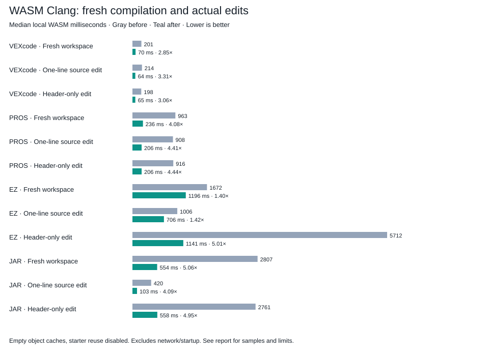

# WASM Clang compilation measurements

October 10, 2026. Intel Core i7-8700K, 32 GB RAM, Linux x64, Bun 1.4.2. Browser tests use Chromium 153 and a local Vite server. These results describe this host and these projects; they do not establish a physical performance limit.

[Interactive graphs](graphs.html) · [Exportable SVG](compilation.svg) · [Raw summary](summary.json)

## Fresh compilation and live edits

Median milliseconds, lower is better. Five samples per baseline case and 7 per optimized case. The historical baseline is commit `efdb141c67128326882091bcd2632fd5a05d3119`, run with its own compiler adapter, package patch and SDK manifest. Both sides use the same edit fixture. Each sample starts a new filesystem with an empty object cache. Starter object reuse is disabled. SDK PCH and validated prebuilt cold firmware are enabled where supported. Source edits change a delay instruction. Header setup changes the source to consume a macro, then the measured header-only edit changes that macro from 46 to 47 without touching the source. Each edit must produce a different binary and compiled main object, excluding timestamp-only changes. Unchanged builds are measured separately in the raw data and excluded from these speedup claims.

These are local WASM compile/link/package timings. They exclude network, SDK mounting, compiler module initialization, editor and UI. They are not cold browser startup measurements.

| Template | Workload | Before ms | After ms | Speedup |
| --- | --- | ---: | ---: | ---: |
| VEXcode | Fresh workspace | 201 | 70 | 2.85× |
| VEXcode | One-line source edit | 214 | 64 | 3.31× |
| VEXcode | Header-only edit | 198 | 65 | 3.06× |
| PROS | Fresh workspace | 963 | 236 | 4.08× |
| PROS | One-line source edit | 908 | 206 | 4.41× |
| PROS | Header-only edit | 916 | 206 | 4.44× |
| EZ | Fresh workspace | 1672 | 1196 | 1.40× |
| EZ | One-line source edit | 1006 | 706 | 1.42× |
| EZ | Header-only edit | 5712 | 1141 | 5.01× |
| JAR | Fresh workspace | 2807 | 554 | 5.06× |
| JAR | One-line source edit | 420 | 103 | 4.09× |
| JAR | Header-only edit | 2761 | 558 | 4.95× |



## Real application measurements

All templates use the real `/build-demo` editor, Build button, worker and downloaded artifacts. The first sample clears application asset and object caches. Later fresh samples restart the worker and clear objects while retaining downloaded assets. Browser wall time includes initialization and UI completion. Source/header edit medians use three samples. Warm fresh medians use two samples. A single empty-asset-cache observation per template is descriptive, not a distribution. Browser/V8 and HTTP cache state are not fully cold.

The startup comparison begins after the filesystem, SDK PCH, frontend plans and streaming improvements. It measures the later compiler selection, compressed resource transfer, concurrent optional assets and development serving changes. It is not a historical-original browser baseline. Earlier browser header measurements changed both header and source, so they are excluded from live-edit comparisons.

| Template | Before transfer changes, empty assets s | Final, empty assets s | Warm assets / fresh objects ms | Source edit ms | Header-only edit ms |
| --- | ---: | ---: | ---: | ---: | ---: |
| VEXcode | 29.34 | 1.71 | 1139 | 148 | 137 |
| PROS | 32.31 | 2.04 | 1588 | 383 | 353 |
| EZ | 34.84 | 4.80 | 4221 | 1067 | 1460 |
| JAR | 30.77 | 2.81 | 2383 | 259 | 754 |

## Compiler core choice

Median browser wall milliseconds, three samples per case with the improved development asset serving. Original and Binaryen comparisons were sequential, not randomized, so small differences deserve caution. Raw compile spans are included. The stronger VEX/PROS source differences also appear in compiler-only spans. The original core is preferred for VEX, PROS and JAR; EZ favors Binaryen for repeated edits even though its warm-asset fresh build was somewhat slower. Bun tooling favors Binaryen. These are workload and engine tradeoffs, not a universal compiler ranking.

| Template | Original source ms | Binaryen source ms | Original header ms | Binaryen header ms | Browser default |
| --- | ---: | ---: | ---: | ---: | --- |
| VEXcode | 150 | 220 | 137 | 165 | Original |
| PROS | 370 | 520 | 323 | 307 | Original |
| EZ | 1133 | 1081 | 1567 | 1458 | Binaryen |
| JAR | 241 | 271 | 761 | 782 | Original |

## What changed

- Writable compiler files grow geometrically, removing repeated whole-file allocation and copying. Seek holes, truncation, overwrite and host byte ownership are verified against the actual patched runtime.
- All four SDKs have checked prefix PCH assets. Project declarations remain live after the SDK prefix. Dependency, inventory, argument and exact-prefix checks select the safe path.
- The pinned Clang driver generates standard frontend plans. Exact matching commands run through public `Session.exec`; custom commands use the ordinary driver.
- Browser builds use the original core for VEX, PROS and JAR, and Binaryen for EZ. Bun tooling uses Binaryen for all templates. Chromium comparisons favored the original core for VEX/PROS/JAR source edits and fresh builds; EZ repeated edits favored Binaryen. No one core won every workload. Two immutable compiler identities cache their compiled WASM modules, with bounded retention and retry after failure.
- Independent WASM modules compile concurrently. Integrity-gated streaming overlaps download and WASM compilation. Metadata and cold SDK assets load alongside startup.
- Development serves prepared WASM compression and gzip SDK bundles directly. Nitro otherwise recompresses every public response. A 13.69 MB already-compressed EZ PCH response took 18.82 seconds with dynamic Brotli versus 19 milliseconds served directly, on this local server. Production retains normal static compression negotiation.
- The 15.10 MB decoded compiler resource archive transfers as a roughly 1.03 MB gzip companion even in development. Decoded checksums still gate use.
- Binaryen 133 optimizes the main compiler module from 63,386,658 to 52,706,432 bytes, a 16.8% reduction. Alternating original/optimized comparisons show mostly small execution gains. A verified compressed build input, deterministic reproduction script, content-addressed public URL and original reference module accompany the change.

## Correctness and limits

66 unit tests and 266 assertions pass. Typecheck, changed-code lint, formatting and production build pass. Real WASM checks cover all templates, custom flags, additions/deletions, compiler errors and recovery, SDK overrides, native objcopy equivalence and packaged cold firmware equivalence. Six configurations per template compare generated code, data, symbols and relocations against the original WASM compiler with full driver and no PCH. ELF comparison resolves symbols and section identities because equivalent PCH output can reorder sections. It is stronger than checking build success, but it is not a mathematical proof of compiler equivalence for arbitrary C++.

The real browser suite records 60 builds across four templates, including header-only changes, and separately verifies three builds while switching compiler variants in one worker. The authenticated `/p/:programId` route also builds and restores saved artifacts. Physical Brain execution was not available in this pass; previous hardware limits still apply.

EZ remains the largest compilation workload. An instrumented Clang phase report attributed roughly 52% to frontend work, 24% to optimization, 15% to machine-code generation and 9% to IR generation. Profiling adds overhead, so these percentages are approximate. Project PCH and multiple compiler workers remain experimental because additional memory, initialization and invalidation costs need target-device measurements. Reducing optimization levels changes generated code and was not used for the reported gains. The pinned toolchain already omits unrelated target backends. Neither main module contains removable WASM custom/debug sections. Further compiler source changes or browser/device-specific tuning may yield gains; I cannot honestly certify that nothing else is physically possible.

## Sample ranges

Minimum and maximum milliseconds, including first-use JIT effects. All raw samples and spans are preserved beside this report.

| Template | Workload | Before range | After range |
| --- | --- | ---: | ---: |
| VEXcode | Fresh workspace | 188 to 448 | 65 to 179 |
| VEXcode | One-line source edit | 183 to 261 | 61 to 82 |
| VEXcode | Header-only edit | 187 to 227 | 60 to 76 |
| PROS | Fresh workspace | 910 to 1004 | 225 to 358 |
| PROS | One-line source edit | 901 to 980 | 199 to 244 |
| PROS | Header-only edit | 902 to 950 | 198 to 217 |
| EZ | Fresh workspace | 1582 to 1980 | 1169 to 1598 |
| EZ | One-line source edit | 922 to 1090 | 689 to 826 |
| EZ | Header-only edit | 5586 to 5909 | 1128 to 1186 |
| JAR | Fresh workspace | 2759 to 2835 | 548 to 611 |
| JAR | One-line source edit | 403 to 429 | 99 to 109 |
| JAR | Header-only edit | 2739 to 2780 | 550 to 571 |

## Reproduce

From the repository root:

```sh
BUILD_BASELINE_REV=efdb141c67128326882091bcd2632fd5a05d3119 BUILD_BENCH_SAMPLES=5 bun apps/code/scripts/benchmark-compiler-edits.ts historical-baseline
BUILD_BENCH_SAMPLES=7 bun apps/code/scripts/benchmark-compiler-edits.ts final-optimized
BUILD_VERIFY_COMPILER_PLANS=1 BUILD_VERIFY_EDITS=1 BUILD_VERIFY_SDK=1 bun apps/code/scripts/verify-browser-builds.ts
```

Run browser measurements from `apps/code` against the running real app:

```sh
BUILD_COMPILER_EDITS=1 BUILD_BENCH_SAMPLES=3 PLAYWRIGHT_BASE_URL=http://localhost:3001 bunx playwright test e2e/compiler-edits.spec.ts --workers=1 --reporter=list
```

Preserve the before-transfer browser records under `.build/compiler-edits/browser-before-transport`, then run `bun apps/code/scripts/report-compiler-edits.ts`. See [compiler reproduction](../../../compiler/README.md) for the Binaryen build input.
